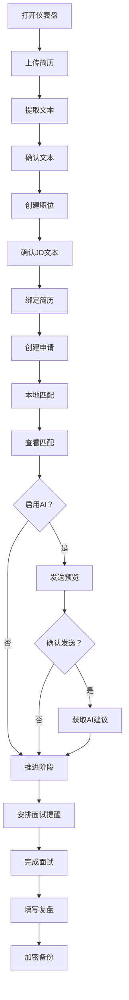

## 业务理解

这是一个本地优先的独立 Web 求职管理工具，面向应届生、实习生及各类职场求职者。用户在浏览器内集中管理多份简历、职位申请、面试与复盘，并通过本地 JD 匹配和可选 AI 顾问获得可解释的优化建议。核心价值是在无需注册或云端存储的前提下，形成从资料准备、申请跟踪到面试复盘和加密备份的完整闭环。

## 业务流程

## 异常/边界

- 简历或 JD 格式不支持、超过 25 MB 或文本提取失败时，保留原文件并转入手动校正，不阻断其他流程。
- AI 配置缺失、地址无效、用户取消发送或请求失败时，不外发简历与 JD，保留本地资料并支持重试。
- 浏览器通知被拒绝或浏览器关闭时，继续提供应用内提醒和 `.ics` 导出，并提示用户同步系统日历。
- 备份密码错误、文件损坏或冲突处理未完成时，导入整体回滚，不覆盖现有本地数据。